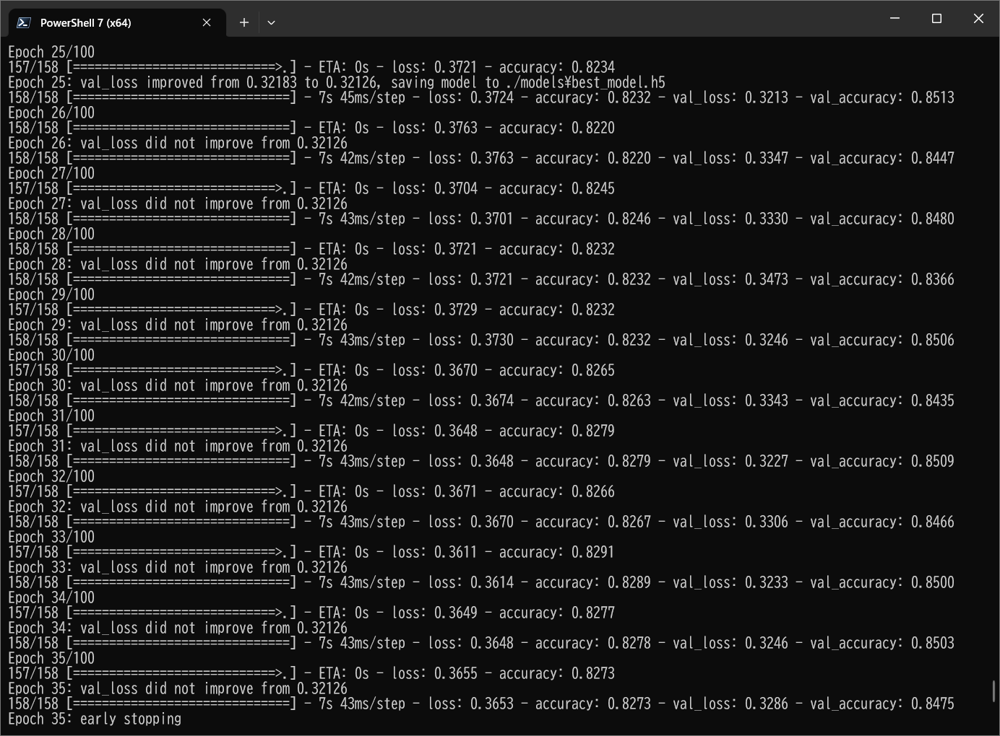
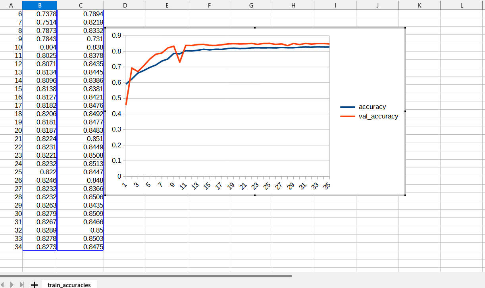
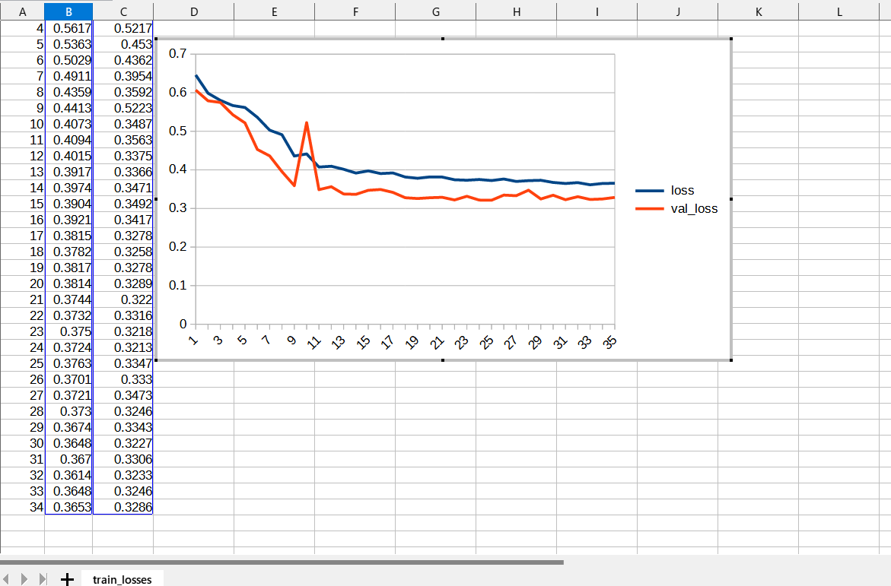

# Image-Segmentation-Acute-Lymphoblastic-Leukemia (Updated: 2023/05/08)

<h2>
1 Image-Segmentation-Acute-Lymphoblastic-Leukemia
</h2>

This is an experimental project for Image-Segmentation of Acute-Lymphoblastic-Leukemia by using
our <a href="https://github.com/atlan-antillia/Tensorflow-Slightly-Flexible-UNet">Tensorflow-Slightly-Flexible-UNet</a> Model.
 

The image dataset used here has been taken from the following web site.

<pre>
1. Acute Lymphoblastic Leukemia (ALL) image dataset
 https://www.kaggle.com/datasets/mehradaria/leukemia
</pre>
<pre>
If you use this dataset in your research, please credit the authors.
Data Citation:
Mehrad Aria, Mustafa Ghaderzadeh, Davood Bashash, Hassan Abolghasemi, Farkhondeh Asadi, and Azamossadat Hosseini, “Acute Lymphoblastic Leukemia (ALL) image dataset.” Kaggle, (2021). DOI: 10.34740/KAGGLE/DSV/2175623.

Publication Citation:
Ghaderzadeh, M, Aria, M, Hosseini, A, Asadi, F, Bashash, D, Abolghasemi, H. A fast and efficient CNN model for B-ALL diagnosis and its subtypes classification using peripheral blood smear images. Int J Intell Syst. 2022; 37: 5113- 5133. doi:10.1002/int.22753
</pre>

See also:

<pre>
2. U-Net: Convolutional Networks for Biomedical Image Segmentation
 https://arxiv.org/pdf/1505.04597.pdf
</pre>

<h2>
2 Prepare dataset
</h2>

<h3>
2.1 Download master dataset
</h3>
 Please download the original dataset from the following link 
<pre>
https://www.kaggle.com/datasets/mehradaria/leukemia/download?datasetVersionNumber=1
</pre>
<b>Acute-Lymphoblastic-Leukemia</b> dataset has the following folder structure. 
<pre>
Acute-Lymphoblastic-Leukemia
├─Original
│  ├─Benign
│  ├─Early
│  ├─Pre
│  └─Pro
└─Segmented
    ├─Benign
    ├─Early
    ├─Pre
    └─Pro
</pre>
 
<h3>
2.2 Split master dataset
</h3>
We have split Acute-Lymphoblastic-Leukemia dataset to <b>train</b> and <b>test</b> dataset 
by using Python <a href="./split_master.py">split_master.py</a> script.
For simplicity, we have split <b>Early</b> category only.
<pre>
ALL
├─test
│  ├─original
│  │  └─Early
│  └─segmented
│      └─Early
└─train
    ├─original
    │  └─Early
    └─segmented
        └─Early
</pre>

<h2>
3 Train TensorflowUNet Model
</h2>
 We have trained Acute-Lymphoblastic-Leukemia TensorflowUNet Model by using the following
 <b>train_eval_infer.config</b> file.  
please run the following command. 
<pre>
>python TensorflowUNetALLTrainer.py
</pre>

<pre>
; train_eval_infer.config
; 2023/5/10 antillia.com

[model]
image_width    = 256
image_height   = 256
image_channels = 3
num_classes    = 1
base_filters   = 16
num_layers     = 6
dropout_rate   = 0.08
learning_rate  = 0.001
show_summary   = True

[train]
epochs        = 100
batch_size    = 4
patience      = 10
model_dir     = "./models"
eval_dir      = "./eval"

image_datapath = "./ALL/train/original/"
mask_datapath  = "./ALL/train/segmented/"
category       = "Early"

[eval]
image_datapath = "./ALL/test/original/"
mask_datapath  = "./ALL/test/segmented/"
category       = "Early"

[infer] 
images_dir    = "./mini_test" 
output_dir    = "./mini_test_output"

</pre>
We have also used Python <a href="./ALLDataset.py">ALLDataset.py</a> script to create
train and test dataset from the original and segmented images specified by
<b>image_datapath</b> and <b>mask_datapath </b> parameters in the configratration file. 

The training process has just been stopped at epoch 35 by an early-stopping callback as shown below.  
 
 
<b>Train accuracies line graph</b>: 
 

 
<b>Train losses line graph</b>: 
 

<h2>
4 Evaluation
</h2>
 We have evaluated prediction accuracy of our Pretrained Acute-Lymphoblastic-Leukemia Model by using <b>test</b> dataset.

Please run the Python script <a href="./TensorflowUNetALLEvaluator.py">TensorflowUNetALLEvaluator.py</a> 
in the following way. 
<pre>
>python TensorflowUNetALLEvaluator.py
</pre>

 
 

<h2>
5 Inference 
</h2>
We have also tried to infer segmented region for <b>mini_test</b> dataset, which is tiny
image set extracted from <b>test</b> dataset,
by using our Pretrained Acute-Lymphoblastic-Leukemia Model. 
Please run the Python script <a href="./TensorflowUNetALLInfer.py">TensorflowUNetALLInfer.py</a> 
in the following way. 
<pre>
>python TensorflowUNetALLInfer.py
</pre>

<b>Input images (mini_test) </b> 
 
 
<b>Infered images (mini_test_output)</b> 

  

