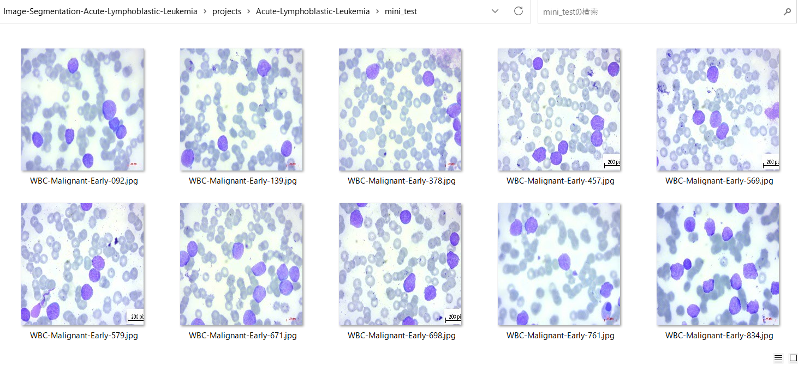

# Image-Segmentation-Acute-Lymphoblastic-Leukemia (Updated: 2023/05/10)

<h2>
1 Image-Segmentation-Acute-Lymphoblastic-Leukemia
</h2>

This is an experimental project for Image-Segmentation of Acute-Lymphoblastic-Leukemia by using
our <a href="https://github.com/atlan-antillia/Tensorflow-Slightly-Flexible-UNet">Tensorflow-Slightly-Flexible-UNet</a> Model.
 

The image dataset used here has been taken from the following web site.

<pre>
1. Acute Lymphoblastic Leukemia (ALL) image dataset
 https://www.kaggle.com/datasets/mehradaria/leukemia
</pre>

If you use this dataset in your research, please credit the authors.
Data Citation:
Mehrad Aria, Mustafa Ghaderzadeh, Davood Bashash, Hassan Abolghasemi, Farkhondeh Asadi, and Azamossadat Hosseini, “Acute Lymphoblastic Leukemia (ALL) image dataset.” Kaggle, (2021). DOI: 10.34740/KAGGLE/DSV/2175623.

Publication Citation:
Ghaderzadeh, M, Aria, M, Hosseini, A, Asadi, F, Bashash, D, Abolghasemi, 
H. A fast and efficient CNN model for B-ALL diagnosis and its subtypes 
classification using peripheral blood smear images. Int J Intell Syst. 2022; 37: 5113- 5133. doi:10.1002/int.22753

See also:

<pre>
2. U-Net: Convolutional Networks for Biomedical Image Segmentation
 https://arxiv.org/pdf/1505.04597.pdf
</pre>
<ul>
<li>
2023/05/10: Updated <a href="./TensorflowUNet.py">TensorflowUNet.py</a> and <a href="./ALLDataset.py">ALLDataset.py</a>.
</li>
</ul>
 
<h2>
2 Prepare dataset
</h2>

<h3>
2.1 Download master dataset
</h3>
 Please download the original dataset from the following link 
<pre>
https://www.kaggle.com/datasets/mehradaria/leukemia/download?datasetVersionNumber=1
</pre>
<b>Acute-Lymphoblastic-Leukemia</b> dataset has the following folder structure. 
<pre>
Acute-Lymphoblastic-Leukemia
├─Original
│  ├─Benign
│  ├─Early
│  ├─Pre
│  └─Pro
└─Segmented
    ├─Benign
    ├─Early
    ├─Pre
    └─Pro
</pre>
 
<h3>
2.2 Split master dataset
</h3>
We have split Acute-Lymphoblastic-Leukemia dataset to <b>train</b> and <b>test</b> dataset 
by using Python <a href="./split_master.py">split_master.py</a> script.
For simplicity, we have split <b>Early</b> category only.
<pre>
ALL
├─test
│  ├─original
│  │  └─Early
│  └─segmented
│      └─Early
└─train
    ├─original
    │  └─Early
    └─segmented
        └─Early
</pre>

<h2>
3 Train TensorflowUNet Model
</h2>
 We have trained Acute-Lymphoblastic-Leukemia TensorflowUNet Model by using the following
 <b>train_eval_infer.config</b> file.  
Please run the following command. 
<pre>
>python TensorflowUNetALLTrainer.py
</pre>

<pre>
; train_eval_infer.config
; 2023/5/10 antillia.com

[model]
image_width    = 256
image_height   = 256
image_channels = 3
num_classes    = 1
base_filters   = 16
num_layers     = 6
dropout_rate   = 0.08
learning_rate  = 0.001
show_summary   = True

[train]
epochs        = 100
batch_size    = 4
patience      = 10
model_dir     = "./models"
eval_dir      = "./eval"

image_datapath = "./ALL/train/original/"
mask_datapath  = "./ALL/train/segmented/"
category       = "Early"

[eval]
image_datapath = "./ALL/test/original/"
mask_datapath  = "./ALL/test/segmented/"
category       = "Early"

[infer] 
images_dir    = "./mini_test" 
output_dir    = "./mini_test_output"

</pre>
We have also used Python <a href="./ALLDataset.py">ALLDataset.py</a> script to create
train and test dataset from the original and segmented images specified by
<b>image_datapath</b> and <b>mask_datapath </b> parameters in the configratration file. 

The training process has just been stopped at epoch 50 by an early-stopping callback as shown below.  
 
 
<b>Train accuracies line graph</b>: 
 

 
<b>Train losses line graph</b>: 
 

<h2>
4 Evaluation
</h2>
 We have evaluated prediction accuracy of our Pretrained Acute-Lymphoblastic-Leukemia Model by using <b>test</b> dataset.

Please run the Python script <a href="./TensorflowUNetALLEvaluator.py">TensorflowUNetALLEvaluator.py</a> 
in the following way. 
<pre>
>python TensorflowUNetALLEvaluator.py
</pre>
The evaluation result of this time is the following. 
 
 
This is slightly better than that of previous result as shown below.  

 

<h2>
5 Inference 
</h2>
We have also tried to infer the segmented region for <b>mini_test</b> dataset, which is a very small dataset including only ten images extracted from <b>test</b> dataset,
 by using our Pretrained Acute-Lymphoblastic-Leukemia Model. 
Please run the following command for Python script <a href="./TensorflowUNetALLInfer.py">TensorflowUNetALLInfer.py</a>. 
<pre>
>python TensorflowUNetALLInfer.py
</pre>

<b>Input images (mini_test) </b> 
 
 
<b>Infered images (mini_test_output)</b> 
Some violet stained elliptical cells in the original images of the mini_test dataset above have been detected as shown below.
  

<h2>
Appendix
</h2>
<h3>Model summary</h3>
Please run the following command to see the summary of TensorflowUNet Model
defined by <b>train_eval_infer.config</b>.  
<pre>
>python TensorflowUNet.py
</pre>
<a href="./asset/model.png">Model Visualization</a>
<pre>
__________________________________________________________________________________________________
 Layer (type)                   Output Shape         Param #     Connected to
==================================================================================================
 input_1 (InputLayer)           [(None, 256, 256, 3  0           []
                                )]

 lambda (Lambda)                (None, 256, 256, 3)  0           ['input_1[0][0]']

 conv2d (Conv2D)                (None, 256, 256, 16  448         ['lambda[0][0]']
                                )

 dropout (Dropout)              (None, 256, 256, 16  0           ['conv2d[0][0]']
                                )

 conv2d_1 (Conv2D)              (None, 256, 256, 16  2320        ['dropout[0][0]']
                                )

 max_pooling2d (MaxPooling2D)   (None, 128, 128, 16  0           ['conv2d_1[0][0]']
                                )

 conv2d_2 (Conv2D)              (None, 128, 128, 32  4640        ['max_pooling2d[0][0]']
                                )

 dropout_1 (Dropout)            (None, 128, 128, 32  0           ['conv2d_2[0][0]']
                                )

 conv2d_3 (Conv2D)              (None, 128, 128, 32  9248        ['dropout_1[0][0]']
                                )

 max_pooling2d_1 (MaxPooling2D)  (None, 64, 64, 32)  0           ['conv2d_3[0][0]']

 conv2d_4 (Conv2D)              (None, 64, 64, 64)   18496       ['max_pooling2d_1[0][0]']

 dropout_2 (Dropout)            (None, 64, 64, 64)   0           ['conv2d_4[0][0]']

 conv2d_5 (Conv2D)              (None, 64, 64, 64)   36928       ['dropout_2[0][0]']

 max_pooling2d_2 (MaxPooling2D)  (None, 32, 32, 64)  0           ['conv2d_5[0][0]']

 conv2d_6 (Conv2D)              (None, 32, 32, 128)  73856       ['max_pooling2d_2[0][0]']

 dropout_3 (Dropout)            (None, 32, 32, 128)  0           ['conv2d_6[0][0]']

 conv2d_7 (Conv2D)              (None, 32, 32, 128)  147584      ['dropout_3[0][0]']

 max_pooling2d_3 (MaxPooling2D)  (None, 16, 16, 128)  0          ['conv2d_7[0][0]']

 conv2d_8 (Conv2D)              (None, 16, 16, 256)  295168      ['max_pooling2d_3[0][0]']

 dropout_4 (Dropout)            (None, 16, 16, 256)  0           ['conv2d_8[0][0]']

 conv2d_9 (Conv2D)              (None, 16, 16, 256)  590080      ['dropout_4[0][0]']

 max_pooling2d_4 (MaxPooling2D)  (None, 8, 8, 256)   0           ['conv2d_9[0][0]']

 conv2d_10 (Conv2D)             (None, 8, 8, 512)    1180160     ['max_pooling2d_4[0][0]']

 dropout_5 (Dropout)            (None, 8, 8, 512)    0           ['conv2d_10[0][0]']

 conv2d_11 (Conv2D)             (None, 8, 8, 512)    2359808     ['dropout_5[0][0]']

 max_pooling2d_5 (MaxPooling2D)  (None, 4, 4, 512)   0           ['conv2d_11[0][0]']

 conv2d_12 (Conv2D)             (None, 4, 4, 1024)   4719616     ['max_pooling2d_5[0][0]']

 dropout_6 (Dropout)            (None, 4, 4, 1024)   0           ['conv2d_12[0][0]']

 conv2d_13 (Conv2D)             (None, 4, 4, 1024)   9438208     ['dropout_6[0][0]']

 conv2d_transpose (Conv2DTransp  (None, 8, 8, 512)   2097664     ['conv2d_13[0][0]']
 ose)

 concatenate (Concatenate)      (None, 8, 8, 1024)   0           ['conv2d_transpose[0][0]',
                                                                  'conv2d_11[0][0]']

 conv2d_14 (Conv2D)             (None, 8, 8, 512)    4719104     ['concatenate[0][0]']

 dropout_7 (Dropout)            (None, 8, 8, 512)    0           ['conv2d_14[0][0]']

 conv2d_15 (Conv2D)             (None, 8, 8, 512)    2359808     ['dropout_7[0][0]']

 conv2d_transpose_1 (Conv2DTran  (None, 16, 16, 256)  524544     ['conv2d_15[0][0]']
 spose)

 concatenate_1 (Concatenate)    (None, 16, 16, 512)  0           ['conv2d_transpose_1[0][0]',
                                                                  'conv2d_9[0][0]']

 conv2d_16 (Conv2D)             (None, 16, 16, 256)  1179904     ['concatenate_1[0][0]']

 dropout_8 (Dropout)            (None, 16, 16, 256)  0           ['conv2d_16[0][0]']

 conv2d_17 (Conv2D)             (None, 16, 16, 256)  590080      ['dropout_8[0][0]']

 conv2d_transpose_2 (Conv2DTran  (None, 32, 32, 128)  131200     ['conv2d_17[0][0]']
 spose)

 concatenate_2 (Concatenate)    (None, 32, 32, 256)  0           ['conv2d_transpose_2[0][0]',
                                                                  'conv2d_7[0][0]']

 conv2d_18 (Conv2D)             (None, 32, 32, 128)  295040      ['concatenate_2[0][0]']

 dropout_9 (Dropout)            (None, 32, 32, 128)  0           ['conv2d_18[0][0]']

 conv2d_19 (Conv2D)             (None, 32, 32, 128)  147584      ['dropout_9[0][0]']

 conv2d_transpose_3 (Conv2DTran  (None, 64, 64, 64)  32832       ['conv2d_19[0][0]']
 spose)

 concatenate_3 (Concatenate)    (None, 64, 64, 128)  0           ['conv2d_transpose_3[0][0]',
                                                                  'conv2d_5[0][0]']

 conv2d_20 (Conv2D)             (None, 64, 64, 64)   73792       ['concatenate_3[0][0]']

 dropout_10 (Dropout)           (None, 64, 64, 64)   0           ['conv2d_20[0][0]']

 conv2d_21 (Conv2D)             (None, 64, 64, 64)   36928       ['dropout_10[0][0]']

 conv2d_transpose_4 (Conv2DTran  (None, 128, 128, 32  8224       ['conv2d_21[0][0]']
 spose)                         )

 concatenate_4 (Concatenate)    (None, 128, 128, 64  0           ['conv2d_transpose_4[0][0]',
                                )                                 'conv2d_3[0][0]']

 conv2d_22 (Conv2D)             (None, 128, 128, 32  18464       ['concatenate_4[0][0]']
                                )

 dropout_11 (Dropout)           (None, 128, 128, 32  0           ['conv2d_22[0][0]']
                                )

 conv2d_23 (Conv2D)             (None, 128, 128, 32  9248        ['dropout_11[0][0]']
                                )

 conv2d_transpose_5 (Conv2DTran  (None, 256, 256, 16  2064       ['conv2d_23[0][0]']
 spose)                         )

 concatenate_5 (Concatenate)    (None, 256, 256, 32  0           ['conv2d_transpose_5[0][0]',
                                )                                 'conv2d_1[0][0]']

 conv2d_24 (Conv2D)             (None, 256, 256, 16  4624        ['concatenate_5[0][0]']
                                )

 dropout_12 (Dropout)           (None, 256, 256, 16  0           ['conv2d_24[0][0]']
                                )

 conv2d_25 (Conv2D)             (None, 256, 256, 16  2320        ['dropout_12[0][0]']
                                )

 conv2d_26 (Conv2D)             (None, 256, 256, 1)  17          ['conv2d_25[0][0]']

==================================================================================================
</pre>

